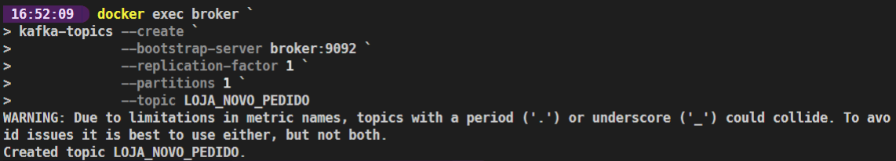
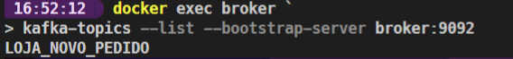

# Aula 1 

## Iniciando o ambiente
```powershell
docker-compose up -d
```

## Criando o tópico LOJA_NOVO_PEDIDO
```powershell
docker exec broker `
kafka-topics --create `
             --bootstrap-server broker:9092 `
             --replication-factor 1 `
             --partitions 1 `
             --topic LOJA_NOVO_PEDIDO
```


## Listando os tópicos
```powershell
docker exec broker `
kafka-topics --list --bootstrap-server broker:9092
```


## Criando um produtor para o tópico LOJA_NOVO_PEDIDO
```powershell
docker exec broker `
kafka-topics --list --bootstrap-server broker:9092
```
